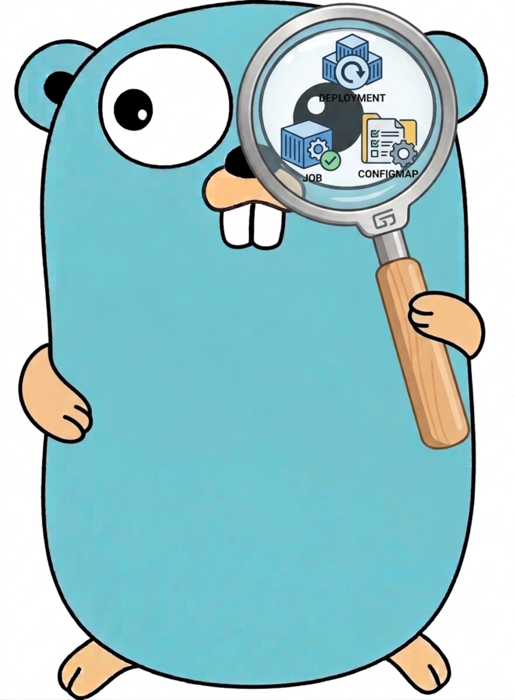

<p align="center">
  
</p>

# whyreconcile

`whyreconcile` is the diagnostic helper for Kubernetes and OpenShift controllers built with `kubebuilder` and/or `operator-sdk` on top of `controller-runtime`.

It helps answer a simple question:

> Why did this `Reconcile()` run?

The library records events from primary, secondary, and externally watched Kubernetes resources, maps them to the actual `reconcile.Request`, and prints a compact explanation before the original `Reconcile()` function is called.

## Why this exists

This module was created after several years of working on multiple commercial OpenShift operators, both complex and relatively simple.

In real operator projects, we often had to debug situations where `Reconcile()` was triggered for reasons that were not immediately obvious. The practical question was usually:

- Which resource caused this reconcile?
- Was it the primary custom resource?
- Was it an owned secondary resource, such as a `Deployment`, `Job`, or `Pod`?
- Was it an external watched resource, such as a `Secret` or `ConfigMap`?
- Was it a spec update, status update, metadata change, retry, or requeue?

The traditional approach was either to attach a debugger in VS Code or to use the timeless classic: many `fmt.Printf()` calls scattered across predicates, handlers, and reconciler code.

The same pattern was also common for new developers joining a project. When the operator logic was not fully clear, and code or documentation was incomplete or outdated (that's for sure!), they often added temporary stdout logs just to understand why reconciliation happened and which fields have been updated.

## What it tracks

`whyreconcile` can track reconcile causes from:

- Primary resources watched through `For(...)`
- Secondary owned resources watched through `Watches(...)` with `EnqueueRequestForOwner(...)`
- External or mapped Kubernetes resources watched through `Watches(...)` with map functions
- Reconcile-derived causes, such as error retry or `RequeueAfter`

## Installation

```bash
go get github.com/arsenalzp/whyreconcile
```

## Basic usage

```go
import (
    whyreconcile "github.com/arsenalzp/whyreconcile/analyzer"
    "github.com/arsenalzp/whyreconcile/store"

    appsv1 "k8s.io/api/apps/v1"
    corev1 "k8s.io/api/core/v1"
    ctrl "sigs.k8s.io/controller-runtime"
    "sigs.k8s.io/controller-runtime/pkg/handler"
)
```

Create an analyzer in `SetupWithManager`:

```go
func (r *WhyReconcileReconciler) SetupWithManager(mgr ctrl.Manager) error {
    wr := whyreconcile.NewAnalyzer(
        "whyreconcile-controller",
        store.NewCauseStore(),
        true,
        mgr.GetScheme(),
        ctrl.Log.WithName("whyreconcile"),
    )

    return ctrl.NewControllerManagedBy(mgr).
        For(
            &watcherv1.WhyReconcile{},
            wr.NewPrimaryOpts("primary"),
        ).
        Complete(wr.WrapReconcile(r))
}
```

This tracks events from the primary custom resource.

## Primary resource example

```go
return ctrl.NewControllerManagedBy(mgr).
    For(
        &watcherv1.WhyReconcile{},
        wr.NewPrimaryOpts("primary"),
    ).
    Complete(wr.WrapReconcile(r))
```

Example non-verbose output:

```text
reconcile causes controller=whyreconcile-controller target=default/whyreconcile-sample causes=1 summary=PrimaryResourceSpecUpdate:1 source=watcher.example.com/v1.WhyReconcile/default/whyreconcile-sample sources=1
```

Meaning:

- `controller=whyreconcile-controller` is the controller name passed to `NewAnalyzer`.
- `target=default/whyreconcile-sample` is the `reconcile.Request` passed to `Reconcile()`.
- `causes=1` means one recorded cause was associated with this reconcile call.
- `summary=PrimaryResourceSpecUpdate:1` means the primary custom resource changed in a way classified as a spec update.
- `source=watcher.example.com/v1.WhyReconcile/default/whyreconcile-sample` is the object that produced the event.
- `sources=1` means there was one unique source object among all causes associated with this reconcile call.

If detailed output is enabled:

```text
reconcile cause detail index=1 watch=primary event=Update cause=PrimaryResourceSpecUpdate source=watcher.example.com/v1.WhyReconcile/default/whyreconcile-sample target=default/whyreconcile-sample oldResourceVersion=100 newResourceVersion=101 oldGeneration=1 newGeneration=2 changedFields=[metadata.generation spec] observedAt=2026-08-15T10:15:30.123456Z
```

Meaning:

- `watch=primary` is the logical watch name.
- `event=Update` is the Kubernetes event type.
- `cause=PrimaryResourceSpecUpdate` is the classified reason.
- `source=watcher.example.com/v1.WhyReconcile/default/whyreconcile-sample` is the object that produced the event.
- `target=default/whyreconcile-sample` is the object key passed to `Reconcile()`.
- `oldResourceVersion` and `newResourceVersion` show the resource version transition.
- `oldGeneration` and `newGeneration` show the generation transition.
- `changedFields` shows a shallow list of changed areas.
- `observedAt` is the time when the cause was recorded.

## Secondary owned resource example

`Owns(...)` does not allow passing a custom event handler directly. To instrument owned resources, use `Watches(...)` with `handler.EnqueueRequestForOwner(...)`.

```go
return ctrl.NewControllerManagedBy(mgr).
    For(
        &watcherv1.WhyReconcile{},
        wr.NewPrimaryOpts("primary"),
    ).
    Watches(
        &appsv1.Deployment{},
        wr.NewSecondaryHandler(
            "owned-deployment",
            handler.EnqueueRequestForOwner(
                mgr.GetScheme(),
                mgr.GetRESTMapper(),
                &watcherv1.WhyReconcile{},
            ),
        ),
    ).
    Complete(wr.WrapReconcile(r))
```

Example non-verbose output:

```text
reconcile causes controller=whyreconcile-controller target=default/whyreconcile-sample causes=1 summary=SecondaryResourceStatusOrMetadata:1 source=apps/v1.Deployment/default/whyreconcile-sample sources=1
```

Detailed output:

```text
reconcile cause detail index=1 watch=owned-deployment event=Update cause=SecondaryResourceStatusOrMetadata source=apps/v1.Deployment/default/whyreconcile-sample target=default/whyreconcile-sample oldResourceVersion=120 newResourceVersion=121 oldGeneration=1 newGeneration=1 changedFields=[status] observedAt=2026-08-15T10:16:12.123456Z
```

Meaning:

- `source=apps/v1.Deployment/default/whyreconcile-sample` is the secondary resource that changed.
- `target=default/whyreconcile-sample` is the owner custom resource that was reconciled.
- `cause=SecondaryResourceStatusOrMetadata` means the owned resource changed, but its generation did not change.
- `changedFields=[status]` means the shallow diff detected a status-level change.
- This explains that the `Deployment` update triggered reconciliation of its owner `WhyReconcile` resource.

## External or mapped resource example

Use this when a watched Kubernetes object is not owned by the primary resource, but should trigger one or more reconciles.

```go
return ctrl.NewControllerManagedBy(mgr).
    For(
        &watcherv1.WhyReconcile{},
        wr.NewPrimaryOpts("primary"),
    ).
    Watches(
        &corev1.ConfigMap{},
        wr.NewExternalHandler(
            "configmap-watch",
            handler.EnqueueRequestsFromMapFunc(r.mapConfigMapToRequests),
        ),
    ).
    Complete(wr.WrapReconcile(r))
```

Example non-verbose output:

```text
reconcile causes controller=whyreconcile-controller target=default/app-a causes=1 summary=ExternalResourceSpecUpdate:1 source=v1.ConfigMap/default/shared-config sources=1
```

Detailed output:

```text
reconcile cause detail index=1 watch=configmap-watch event=Update cause=ExternalResourceSpecUpdate source=v1.ConfigMap/default/shared-config target=default/app-a oldResourceVersion=200 newResourceVersion=201 oldGeneration=1 newGeneration=2 changedFields=[metadata.generation spec] observedAt=2026-08-15T10:17:45.123456Z
```

Meaning:

- `source=v1.ConfigMap/default/shared-config` is the watched external Kubernetes object.
- `target=default/app-a` is the primary resource request returned by the map function.
- `cause=ExternalResourceSpecUpdate` means the watched external resource changed in a way classified as spec-level.
- If the map function returns multiple requests, the same source cause is recorded under each target request.

Example multi-target case:

```text
source=v1.ConfigMap/default/shared-config -> target=default/app-a
source=v1.ConfigMap/default/shared-config -> target=default/app-b
source=v1.ConfigMap/default/shared-config -> target=default/app-c
```

Each target may result in a separate `Reconcile()` call.

## Reconcile-derived causes

`whyreconcile` can also record causes produced by the result of a previous reconcile.

Examples:

```go
return ctrl.Result{RequeueAfter: time.Minute}, nil
```

may produce:

```text
reconcile causes controller=whyreconcile-controller target=default/sample causes=1 summary=ReconcileRequeueAfter:1 source=Reconcile/default/sample sources=1
```

An error:

```go
return ctrl.Result{}, err
```

may produce:

```text
reconcile causes controller=whyreconcile-controller target=default/sample causes=1 summary=ReconcileErrorRetry:1 source=Reconcile/default/sample sources=1
```

Meaning:

- These causes are not Kubernetes watch events.
- They are produced by the previous `Reconcile()` result.
- They are associated with the next reconcile call for the same request.
- `Result.Requeue` is deprecated in modern controller-runtime versions, so `whyreconcile` models returned errors and `RequeueAfter` as first-class reconcile-derived causes.

## Output model

`whyreconcile` separates two concepts.

### Source

The object that caused the event.

Examples:

```text
watcher.example.com/v1.WhyReconcile/default/sample
apps/v1.Deployment/default/sample
v1.ConfigMap/default/shared-config
Reconcile/default/sample
```

### Target

The `reconcile.Request` that was eventually passed to `Reconcile()`.

Examples:

```text
default/sample
default/app-a
default/app-b
```

For primary resources:

```text
source == target
```

For owned secondary resources:

```text
source = owned object
target = owner custom resource request
```

For external or mapped resources:

```text
source = watched object
target = request returned by the map function
```

For reconcile-derived causes:

```text
source = previous Reconcile result
target = same reconcile request
```

### Source summary in non-verbose output

Non-verbose output includes a compact source summary:

```text
source=<source-object> sources=1
```

If all causes associated with a reconcile call came from the same source object, `source` contains that object.

Example:

```text
source=apps/v1.Deployment/default/whyreconcile-sample sources=1
```

If causes came from multiple different source objects, `source` is reported as `multiple` and `sources` contains the number of unique source objects.

Example:

```text
source=multiple sources=3
```

Use detailed output to see every individual cause, source, target, event type, resource version, generation, changed fields, and observation time.

### Changed fields

For update events, `whyreconcile` performs a shallow comparison and may report changed areas such as:

```text
spec
status
metadata.name
metadata.namespace
metadata.labels
metadata.annotations
metadata.finalizers
metadata.ownerReferences
metadata.deletionTimestamp
metadata.generation
```

It intentionally reports field paths, not old and new values.

This keeps the output compact and avoids accidentally printing sensitive data.

### Why requests can have multiple causes

Kubernetes controller workqueues deduplicate equal requests.

For example, several events may enqueue the same request:

```text
default/whyreconcile-sample
default/whyreconcile-sample
default/whyreconcile-sample
```

The workqueue may process it as one actual `Reconcile()` call.

`whyreconcile` stores all recorded causes under the same request and prints them together when the actual reconcile starts.

### Minimal output

Summary with one source:

```text
reconcile causes controller=whyreconcile-controller target=default/sample causes=1 summary=SecondaryResourceStatusOrMetadata:1 source=apps/v1.Deployment/default/sample sources=1
```

Summary with multiple sources:

```text
reconcile causes controller=whyreconcile-controller target=default/sample causes=3 summary=PrimaryResourceSpecUpdate:1, SecondaryResourceStatusOrMetadata:2 source=multiple sources=2
```

Detailed output:

```text
reconcile cause detail index=1 watch=primary event=Update cause=PrimaryResourceSpecUpdate source=watcher.example.com/v1.WhyReconcile/default/sample target=default/sample oldResourceVersion=10 newResourceVersion=11 oldGeneration=1 newGeneration=2 changedFields=[metadata.generation spec] observedAt=2026-08-15T10:20:00.123456Z
```